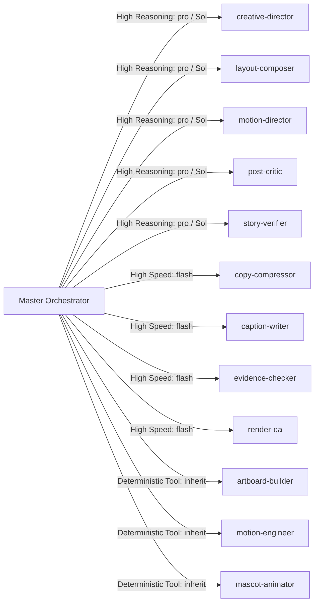
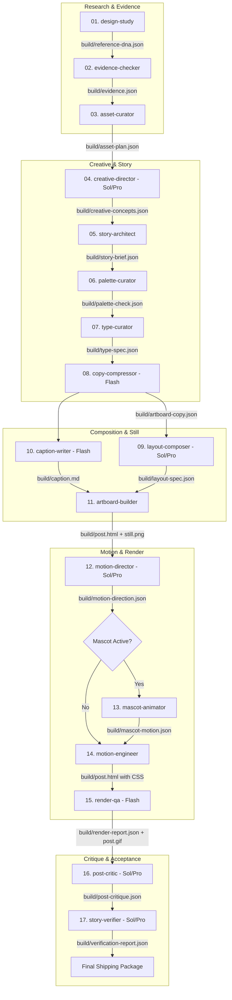

# LinkedIn Animated Infographics: Orchestration Playbook & Subagent Reference

This document provides exact invocation patterns, handoff JSON schemas, prompt templates, Model Router configurations, and Watchdog diagnostic recipes for the LinkedIn Animated Infographics multi-agent ecosystem.

---

## 1. MasterOne Front-Door Integration

### 1.1 Profile Schema Structure (`.linkedin-infographics/profile.json`)
```json
{
  "project_name": "My Brand Campaign",
  "brand": {
    "primary_color": "#246BFD",
    "accent_color": "#1A4FBF",
    "logo_path": "assets/brand/logo.svg",
    "avatar_path": "assets/brand/avatar.png"
  },
  "content": {
    "default_language": "en",
    "audience": "AI Engineers & B2B SaaS Founders"
  },
  "copyright": {
    "owner": "Mamdouh Aboammar",
    "footer_required": true,
    "footer_text": "Mamdouh Aboammar · prepilot.cloud"
  },
  "typography": {
    "primary_font": "System UI",
    "heading_font": "Geist Mono"
  },
  "linkedin": {
    "output_mode": "animated"
  },
  "mascot": {
    "id": null,
    "asset_path": null,
    "auto_use": false
  },
  "references": {
    "primary_directory": "demos/owned",
    "mode": "inspiration"
  }
}
```

---

## 2. Intelligent Agent Router & Model Tier Matrix

The orchestrator dynamically routes subagents using `invoke_subagent` with explicit model tiers:



### Model Invocation Examples

#### High-Reasoning Worker Invocation (GPT-5.6 Sol / Pro Tier):
```json
{
  "Subagents": [
    {
      "TypeName": "creative-director",
      "Role": "Creative Director (High Reasoning)",
      "Model": "pro",
      "Prompt": "Analyze build/evidence.json and build/asset-plan.json. Synthesize 3 distinct creative concept directions with visual hooks, copy hooks, and useful aha mechanics. Output to build/creative-concepts.json."
    }
  ]
}
```

#### High-Speed Worker Invocation (Flash / Mini Tier):
```json
{
  "Subagents": [
    {
      "TypeName": "copy-compressor",
      "Role": "Copy Compressor (High Speed)",
      "Model": "flash",
      "Prompt": "Compress the approved concepts from build/creative-concepts.json into slot-fitted hooked microcopy based on build/type-spec.json. Output to build/artboard-copy.json."
    }
  ]
}
```

---

## 3. 30-Second Liveness Watchdog Protocol

### 3.1 Initializing the Watchdog
Before dispatching multi-step pipelines, arm the 30-second watchdog:
```json
{
  "DurationSeconds": 30,
  "TimerCondition": "any",
  "Prompt": "Watchdog Heartbeat: Check active worker status, inspect build/ artifact mtimes, and detect stalls."
}
```

### 3.2 Heartbeat Execution Routine
When the watchdog triggers:
1. Call `manage_subagents(Action="list")` to inspect live lifecycle states.
2. Check `build/` files for updated output timestamps.
3. **Stall Handling**:
   - If a subagent has been in `running` state for **> 60 seconds (2 watchdog ticks)** without updating its expected target artifact:
     - Step 1: Send a ping via `send_message(Recipient=conv_id, Message="Status check: please report current step or blocking failure.")`.
     - Step 2: If no response within the next tick, terminate via `manage_subagents(Action="kill", ConversationIds=[conv_id])` and re-dispatch with a simplified prompt.
4. **Re-arm Watchdog**: Set the next 30-second timer until all pipeline stages report `PASS`.

---

## 4. Worker Invocation Flowchart & Artifacts



---

## 5. Troubleshooting & HOLD Scenarios

| HOLD Scenario | Root Cause | Mandatory Resolution |
| :--- | :--- | :--- |
| `HOLD: Unresolved Identity` | A requested brand mark has no verified SVG in repo and no match on Lobe. | Request exact SVG from user or remove the logo slot from the concept. Never trace or invent a logo. |
| `HOLD: Remote Font Network Call` | CSS contains `@import url('https://fonts.googleapis.com/...')`. | Convert font to Base64 WOFF2 `@font-face` string or switch to system font stack. |
| `HOLD: Broken Animation Seam` | Render QA reports seam ratio `> x1.5`. | Check that `@keyframes` values at `0%` and `100%` are identical and all sub-delays are integer fractions of `--loop`. |
| `HOLD: Bloated GIF File Size` | GIF file size exceeds 5 MB due to blur filters or large moving gradients. | Replace `filter: blur()` with layered ghost trail elements (`.trail.t1`, `.trail.t2`) with negative delays. |
| `HOLD: Subagent Stall / Timeout` | Worker ran for > 60s without progress. | 30s Watchdog detects stall, terminates hung conversation, and restarts with bounded prompt scope. |
