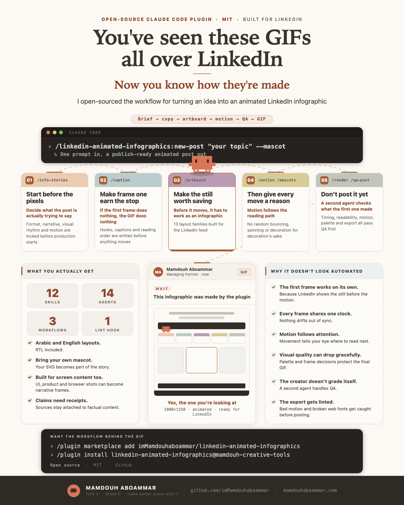

<div align="center">

# LinkedIn Animated Infographics

**Turn imagination into visual stories that stop the scroll and make the idea click**

`Claude Code + Codex + ChatGPT · 3.2.2` · `1080×1350` · `Info-stories` · `Exact-SVG mascots` · `Arabic / RTL`

<br>

<a href="./assets/demo_artboard_v4.gif">
  
</a>

<sub>Live 1080×1350 demo · click to open full size</sub>

</div>

## WOW first, AHA after

<strong>WOW stops the scroll<br>AHA makes the idea click</strong>

The plugin aims for both

**WOW** is the visual pull: a strong concept, a clear focal point, confident color, smart composition, and motion with a job

**AHA** is the payoff: the reader sees a relationship, comparison, transformation, state change, interface flow, or reveal that makes the idea easier to understand

If the effect looks good but adds no meaning, it is decoration

`creative-director` develops the concept before layout starts in the Claude runtime. The OpenAI package uses capability negotiation: real side jobs and sandbox artifacts when the host exposes them, then truthful sequential or skill-only fallbacks when it does not

## Install

Version 3.2.2 keeps host execution isolated on purpose

- Claude uses the existing `skills/` + `agents/` runtime and native worker graph
- ChatGPT and Codex use the self-contained `openai-skills/` distribution
- repository-development Codex can use real project-scoped subagents from `.codex/agents/`
- the public OpenAI skill never assumes those repo agents exist after installation
- quality parity means equivalent discipline and acceptance criteria, not identical visual output

### Claude Code

```text
/plugin marketplace add imMamdouhaboammar/linkedin-animated-infographics
/plugin install linkedin-animated-infographics@mamdouh-creative-tools
```

Validate a checkout with:

```bash
claude plugin validate .
```

### Codex + ChatGPT

Add the repository marketplace:

```bash
codex plugin marketplace add imMamdouhaboammar/linkedin-animated-infographics --ref main
codex plugin marketplace list
```

The OpenAI package is `.codex-plugin/plugin.json`; the repo marketplace is `.agents/plugins/marketplace.json`; the public skills bundle is `openai-skills/`

[Codex / ChatGPT guide](docs/codex.md) · [Marketplace details](docs/marketplace.md)

## OpenAI autopilot

`linkedin-infographic-autopilot` begins by observing the capabilities actually exposed by the current host

It selects exactly one execution path:

```text
full-autopilot
  real side jobs + sandbox/tools when observed

tool-rich-sequential
  sandbox/tools + sequential role contracts

safe-skill-only
  bounded planning/critique only, with HOLD when execution is required
```

Unknown capabilities are treated as unavailable. The plugin never claims a subagent, tool call, render, file, connected-app action, or publication action that did not actually happen

Evidence finishes first. After the evidence boundary is finalized, real delegation can fan out creative-direction exploration, visual-archetype exploration, and copy-compression critique in parallel. Dependency-bound production then proceeds through explicit gates

When sandbox writes are available, the workflow persists logical artifacts for evidence, concepts, copy, layout, build, still review, motion, render QA, verifier output, and final delivery. This reduces context loss and lets later QA inspect the same production inputs

Workspace Agents are optional external execution capabilities. Installing the skills-only plugin does not automatically register them

## OpenAI visual discipline

The OpenAI package does not collapse concept, layout, motion, and QA into one pass

Its production flow is:

```text
capability negotiation
  -> evidence research and finalized evidence boundary
  -> parallel creative side jobs when real delegation exists
  -> creative directions
  -> story architecture
  -> copy compression
  -> macro layout
  -> still construction
  -> complete still taxonomy + targeted repair
  -> motion direction only after still PASS
  -> motion implementation
  -> render QA
  -> independent final verification
```

The still gate is blocking before motion

It explicitly rejects top-heavy compositions, unexplained bottom dead zones, detached footers, weak visual anchors, nested-card density, generic UI grammar, weak macro rhythm, feed-scale legibility failures, motion on weak stills, and decorative motion

The full Autopilot visual contract also keeps the 1080×1350 default canvas, roughly 82-92% usable vertical occupancy target, greater-than-120px unexplained footer-gap rejection, maximum two bordered containment levels, and explicit PASS/FAIL taxonomy from the studio quality floor

## Demos

There are two shelves:

- **Created by Mamdouh** under `demos/owned/`
- **Created by the community** under `demos/community/<github-user>/`

Every accepted demo is the same portable package: **GIF + HTML + demo.json**

After final verification `PASS`, the plugin can ask `Share this demo with the community?` If the user says yes, `share-demo` validates the public package and `community-publisher` can prepare a contributor fork, branch, commit, push, and pull request. It stops at the PR. Every contribution still needs maintainer manual review and merge

[Browse the demo gallery](demos/README.md) · [Read the contribution contract](docs/community-demos.md)

## What it makes

A strong output should have

| Part | Standard |
| --- | --- |
| **Hook** | One opening idea worth stopping for |
| **Visual idea** | One dominant concept readable at feed size |
| **WOW** | A fresh visual or motion move that serves the story |
| **AHA** | A payoff that changes understanding |
| **Story** | A clear shape such as comparison, process, transformation, proof, interface flow, or framework |
| **Color** | Creative and attractive without becoming loud |
| **Composition** | Intentional macro rhythm with no unexplained dead space |
| **Motion** | Deliberate, deterministic, and tied to meaning |
| **Evidence** | Claims, metrics, product states, logos, and proof tied to supplied material |
| **Finish** | Still QA, mechanical QA, critique, and independent verification |

## Creative runtime

Before story architecture starts, Claude's `creative-director` creates at least three genuinely different directions in `build/creative-concepts.json`

The OpenAI autopilot applies the same creative standard. Evidence is finalized first. With real delegation observed, the creative-direction, visual-archetype, and copy-compression discovery jobs can then run in parallel. Without delegation, the same contracts run sequentially without pretending agents were spawned

Each direction defines a visual hook, copy hook, aha mechanic, story shape, visual archetype, motion behavior, evidence dependencies, risks, and why the idea deserves attention

At least one direction must contain a real visual payoff, not a palette swap or a new card arrangement

## Info-stories

Info-stories separates four decisions:

1. **Story House** for visual character and palette
2. **Visual Style** for composition grammar
3. **Story Archetype** for information structure
4. **Motion Pattern** for how attention moves

The canonical Claude/repository source of truth is the merged registry returned by `scripts/info_stories.py::load_catalog()`

The OpenAI public package carries the execution rules it needs inside `openai-skills/` instead of depending on unavailable repository worker registration

UI Mockup Stories are first-class options. Real-looking product behavior must be supported by evidence. Concept UI stays clearly identifiable when it could be mistaken for real product proof

## Exact-SVG mascots

If the user asks for a named or official mascot, the plugin uses the **exact SVG supplied by the user or attached to the task**

No silent redraw
No substitute
No lookalike

The Claude mascot path inspects the supplied SVG, finds usable geometry, develops motion around the real asset, preserves identity, and checks the animated result against the untouched source

```bash
python3 scripts/mascot_contract.py directions
python3 scripts/mascot_contract.py check build/mascot-request.json
```

## Claude connected production path

Read [`helper/GUIDE.md`](helper/GUIDE.md) before choosing a Claude workflow or worker

```text
design-study
  -> evidence-checker
  -> creative-director
  -> story-architect
  -> palette-curator
  -> copy-compressor
  -> layout-composer
  -> caption-writer
  -> artboard-builder
  -> motion-director
  -> optional mascot-animator
  -> motion-engineer
  -> render-qa
  -> post-critic
  -> story-verifier
  -> optional share-demo
```

`new-post` is the Claude production parent workflow. `share-demo` is a separate opt-in parent workflow after verified delivery

Workers return artifacts to their parent instead of coordinating peers through hidden handoffs

## Research that ships as behavior

`research/` is part of repository production logic, not a reading folder

Current gates:

`prose-specificity` · `voice-preservation` · `design-dials` · `structural-originality` · `reference-dna` · `contrast-discipline` · `evidence-traceability` · `bounded-verification`

Each adopted gate keeps source provenance, inspected commit SHA, local behavior, stage, severity, owners, implementation references, and tests

## Visual defaults

- Palette character: `creative-attractive-restrained`
- Text contrast: `4.5:1` minimum
- State contrast: `3:1` minimum
- One dominant visual anchor at feed scale
- Macro zones before component styling
- Motion intensity comes from the story, not from a need to animate everything

The OpenAI visual contract additionally targets roughly 82-92% usable vertical occupancy, rejects unexplained gaps greater than 120px near the footer, and limits bordered containment depth to two levels

## Workflows

Claude repository workflows:

```text
/linkedin-animated-infographics:new-post    [topic or URL] [--arabic] [--mascot]
/linkedin-animated-infographics:render-gif  [path.html] [--duration 6.0] [--fps 12.5]
/linkedin-animated-infographics:qa-post     [path.html] [caption.md]
/linkedin-animated-infographics:share-demo  [build directory]
```

OpenAI public workflows:

```text
openai-skills/linkedin-infographic-autopilot/SKILL.md
openai-skills/linkedin-infographic-studio/SKILL.md
openai-skills/linkedin-infographic-review/SKILL.md
openai-skills/exact-svg-mascot/SKILL.md
openai-skills/share-community-demo/SKILL.md
```

Programmatic repository routing:

```bash
python3 tools/route_request.py --request "Create an animated LinkedIn infographic"
```

## Visual intelligence

Python 3.11 or newer is required. Run `python3 scripts/reference_intelligence.py ingest --library /path/to/gifs` then `python3 scripts/reference_intelligence.py check`; state is ignored under `.plugin-state/reference-studies/`. Use `python3 tools/story_retrieve.py --query query.json` for deterministic UTF-8 byte-budgeted capsules. Provenance and reuse rights remain unverified unless explicitly supplied.

## Strict validation

Disconnected capability means failure

```bash
python3 -m unittest discover -s tests -v
python3 -m compileall -q scripts tools skills/svg-mascot-animator/scripts
python3 scripts/info_stories.py check
python3 scripts/ecosystem_router.py check
python3 scripts/research_gates.py check
python3 scripts/plugin_graph.py check
python3 scripts/ecosystem_doctor.py check
python3 scripts/demo_gallery.py check
python3 scripts/validate_marketplace.py
python3 scripts/validate_codex_plugin.py
claude plugin validate .
```

`scripts/ecosystem_doctor.py` rejects dead, undeclared, unreachable, untested, disconnected, or unsafe public modules and manifest references

`scripts/validate_codex_plugin.py` rejects OpenAI packaging drift, non-self-contained OpenAI runtime references, fake capability assumptions, missing autopilot contracts, missing real repo Codex agent registrations, directory compliance regressions, missing visual-quality gates, submission-readiness drift, and cross-host version drift

## Public Plugins Directory

The 3.2.2 OpenAI package is prepared as a skills-only update using `openai-skills/`

`submission/` tracks listing metadata, five positive reviewer cases, three negative cases, and the manual OpenAI Platform handoff

A GitHub commit does not automatically replace the version already published in the directory. A new release still needs the supported OpenAI Platform update and publication flow

## Public tools

```text
tools/story_scaffold.py
tools/composition_check.py
tools/palette_preview.py
tools/copy_slop_check.py
tools/contrast_check.py
tools/fingerprint_check.py
tools/route_request.py
scripts/demo_gallery.py
scripts/demo_submit.py
```

## Documentation

- [Architecture](docs/ecosystem.md)
- [Routing protocol](docs/routing.md)
- [Agents](docs/agents.md)
- [Skills](docs/skills.md)
- [Codex + ChatGPT](docs/codex.md)
- [Community demos](docs/community-demos.md)
- [Demo gallery](demos/README.md)
- [Research gates and provenance](docs/research.md)
- [Marketplace packaging](docs/marketplace.md)
- [Development and validation](docs/development.md)

Coding agents should also read [`AGENTS.md`](AGENTS.md) or [`CLAUDE.md`](CLAUDE.md)

Both point to the same helper, research, module, and validation authority for repository development

## License

MIT
