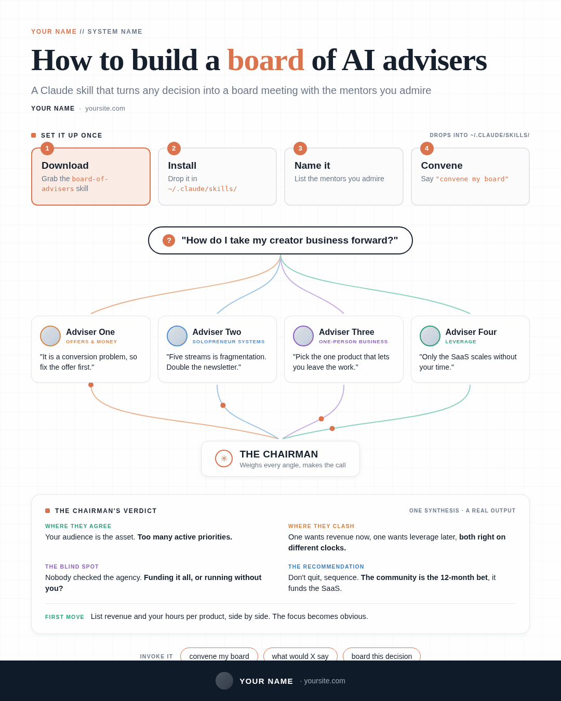
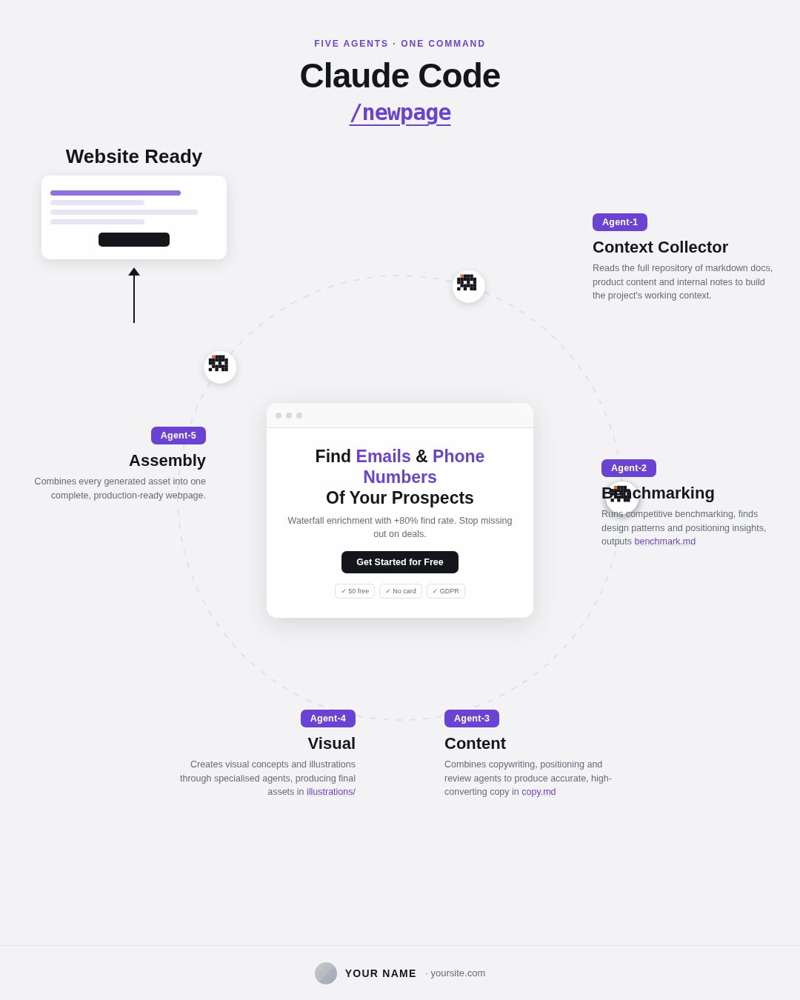
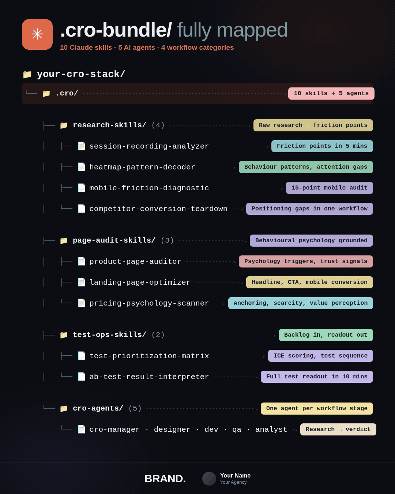
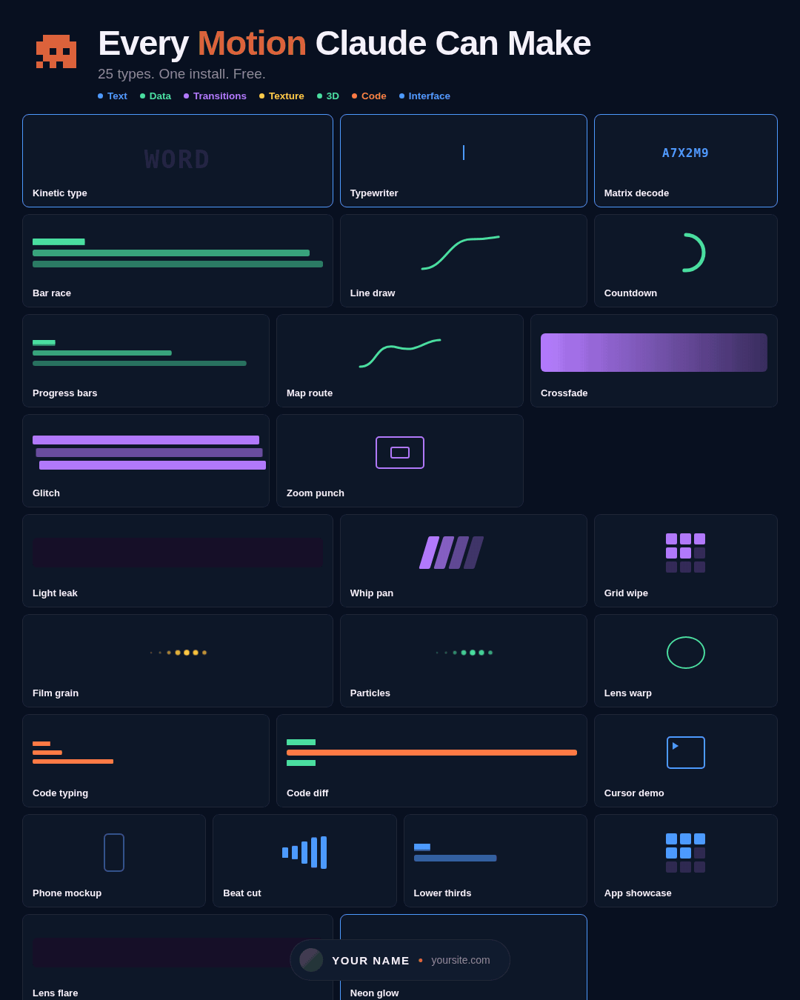

<div align="center">

# `linkedin-animated-infographics`

### Those looping GIF infographics on LinkedIn are 90% static.

**A Claude Skill that builds the caption, designs the artboard, and renders the GIF. Deterministically. Under 5 MB. In Arabic too.**

<br>


<br><br>

```
topic → archetype → caption → HTML artboard → seeked frames → GIF
                                                    ↑
                                          this is the part
                                          everyone gets wrong
```

<br>






<sub>Four bundled templates, rendered by the pipeline in this repo. <b>0.22 · 1.16 · 0.73 · 1.36 MB</b></sub>

</div>

<br>

## The thing nobody tells you

I pulled apart the best-performing animated infographics on my feed, frame by frame.

|  | Board of Advisers | Agent Orbit | Motion Catalogue |
| --- | --- | --- | --- |
| Canvas | 1080×1350 | 1080×1350 | 1080×1350 |
| Frames | 30 | 230 | 120 |
| Frame delay | 120ms | 30–40ms | 50ms |
| Duration | 3.6s | 7.67s | 6s |
| Size | 4.8 MB | 2.4 MB | 2.5 MB |
| Area that *looks* like it moves | ~11% | ~14% | **~85%** |
| **Changed pixels per frame** | 0.08% | 0.03% | 1.09% |
| **Bytes per frame** | **157 KB** | 10 KB | **20 KB** |

Two of these are static infographics with a reading pointer moving through them. The headline never moves. The cards never move. The footer never moves. An accent outline walks four boxes, four dots slide down four curves, and that is the entire animation.

The third animates its whole canvas — 42 independent micro-demos running at once — and still encodes at an eighth of the per-frame cost of the one that animates 11%.

So the rule everyone repeats, *keep under 20% of the canvas moving*, is measuring the wrong thing. What actually costs you is **changed pixels per frame**, and **palette pressure from the background**. Forty-two tiny flat-colour animations on a dark flat ground touch fewer pixels than one accent wash sweeping a card on a light textured one.

`build_gif.py` reports the real number. Judge on that.

```
motion   : 0.53% of pixels change per frame — healthy
loop     : biggest frame-to-frame change 3.19%, seam 1.63% (x0.51) — closes cleanly
encode   : 128 colours                   1.36 MB   FITS
```

## What you get

```
linkedin-animated-infographics/
├── SKILL.md                          the router
├── references/
│   ├── caption-patterns.md           6 caption archetypes, line by line
│   ├── visual-archetypes.md          12 layout families, structural specs
│   ├── animation-recipes.md          8 motion primitives, working CSS
│   ├── design-systems.md             4 house palettes, type scale, tokens
│   ├── production-pipeline.md        setup, flags, troubleshooting
│   ├── arabic-rtl.md                 mirroring, bidi, dialect, numerals
│   ├── qa-gates.md                   10 gates before you export
│   └── publishing-playbook.md        upload, comment gates, timing
├── scripts/
│   ├── capture_frames.py             WAAPI + SMIL seeking
│   ├── build_gif.py                  palette ladder, auto size budget
│   ├── check_render.py               still + mobile 350px + motion audit
│   ├── render.sh                     one command, HTML → GIF
│   └── setup.sh                      installs everything
└── assets/
    ├── template-flow-map.html        converging inputs → one verdict
    ├── template-orbit-cycle.html     nodes orbiting a centre artifact
    ├── template-directory-map.html   monospace tree + annotation pills
    └── template-specimen-grid.html   25 live micro-demos in one grid
```

<br>

## Install

**Vercel skills CLI** (works with 50+ agents)

```bash
npx skills add imMamdouhaboammar/linkedin-animated-infographics
```

**GitHub CLI** (v2.90+)

```bash
gh skill install imMamdouhaboammar/linkedin-animated-infographics
```

**Manual**

```bash
git clone https://github.com/imMamdouhaboammar/linkedin-animated-infographics.git \
  ~/.claude/skills/linkedin-animated-infographics
```

Then set up the renderer once:

```bash
cd ~/.claude/skills/linkedin-animated-infographics
bash scripts/setup.sh
```

<br>

## Render one in 30 seconds

```bash
bash scripts/render.sh assets/template-flow-map.html out.gif --duration 4.8 --fps 12.5
```

```
── capture ──────────────────────────────────
loop      : 4.8s @ 12.5 fps -> 60 frames
animations: 4 found, 4 infinite
done      : 60 frames in .frames/

── assemble ─────────────────────────────────
frames    : 60 @ 12.5 fps (4.80s)
loop      : biggest frame-to-frame change 0.46%, seam 0.44% (x0.96) — closes cleanly
encode    : 128 colours                   0.22 MB   FITS

output    : out.gif  (0.22 MB)
```

**0.22 MB.** The reference file it is modelled on is 4.8 MB.

<br>

## Why it renders clean

Screen-recording an animation samples whatever the compositor happened to produce. It drifts, it jitters, and the loop never quite closes.

This **seeks** instead:

```js
document.getAnimations().forEach(a => { a.pause(); a.currentTime = tMs; });
document.querySelectorAll('svg').forEach(s => s.setCurrentTime(tMs / 1000));
```

Ask the browser for the exact state at time `t`. Screenshot. Repeat. Every frame is pixel-exact and the loop closes by arithmetic rather than by luck.

Line one covers CSS `@keyframes` and WAAPI. Line two covers SVG SMIL, which lives on a separate timeline that nobody remembers until their `<animateMotion>` renders frozen.

`capture_frames.py` also traps `requestAnimationFrame` and warns you, because rAF motion cannot be seeked at all.

<br>

## Chrome flags that matter more than they look

| Flag | Why |
| --- | --- |
| `--disable-lcd-text` | subpixel antialiasing paints coloured fringes on every glyph. Hundreds of extra palette entries, for text you cannot even read in feed |
| `--font-render-hinting=none` | identical glyph rasterisation across frames, so static text diffs to exactly zero and the encoder skips it |
| `--force-color-profile=srgb` | without it your colours shift between machines |
| `--disable-gpu` | GPU rasterisation is non-deterministic frame to frame |

Then a two-pass ffmpeg palette, weighted toward pixels that actually change:

```bash
ffmpeg -framerate 12.5 -i f%04d.png \
  -vf "palettegen=max_colors=128:stats_mode=diff" palette.png

ffmpeg -framerate 12.5 -i f%04d.png -i palette.png \
  -lavfi "paletteuse=dither=bayer:bayer_scale=4:diff_mode=rectangle" \
  -loop 0 out.gif
```

`bayer` over `sierra2_4a` on flat vector art: ordered dithering produces a **stable** pattern across frames, so static regions compress. Error diffusion changes every frame and doubles your file.

`build_gif.py` walks a reduction ladder automatically. Palette first, then frame rate, then resolution, printing every trade it makes.

<br>

## Three bugs it caught while I was building it

This is the part I would want to read.

**1. The reverse-delay trap**

The intuitive stagger is wrong:

```css
/* looks right. produces 1 → 4 → 3 → 2 */
.step:nth-child(2) { animation-delay: calc(var(--loop) * -1 / 4); }
.step:nth-child(3) { animation-delay: calc(var(--loop) * -2 / 4); }
.step:nth-child(4) { animation-delay: calc(var(--loop) * -3 / 4); }
```

A negative delay pushes an animation **forward** in its cycle. The element that should fire last needs the *smallest* offset. Reverse the order. It looks fine in a thumbnail and it is obviously broken the second anyone watches it.

**2. `:first-of-type` fires once per parent**

```css
.row.hl:first-of-type { animation-delay: 0ms; }
```

The rows lived inside several `.grp` wrappers, so this matched the first row in *every* group. Six rows lit up simultaneously and CSS threw no error. Silent, and invisible until you diff the frames.

**3. The `animation:` shorthand eats your phase offsets**

`.demo > svg > *` and `.sp-line path` both compute to specificity (0,1,1) — `*`
contributes nothing — so source order decided it, and the shorthand's implicit
`animation-delay: 0s` cancelled every stagger in the grid. Longhands only inside
specimen rules.

**4. The loop check itself was wrong**

Version one compared frame 0 to the last frame. That flags every continuously-moving design as broken, because the last frame legitimately sits one step before the loop point.

The correct baseline is the **largest change between any two consecutive frames anywhere in the loop**. If the seam is no bigger than that, the seam is indistinguishable from any other frame boundary, which is what a clean loop actually means.

Rewriting the metric is what surfaced bug #2.

<br>

## The archetypes

**7 caption patterns**, each with a line-by-line skeleton, a hook library and a CTA library:

`Numbered Inventory` · `Result Case Study` · `Bundle Manifest` · `Setup Walkthrough` · `Operating Story` · `Belief Correction` · `Catalogue Tease`

**13 visual archetypes**, each with structural specs, what to animate, and the failure mode:

`Directory Map` · `Flow Map + Verdict` · `Orbit Cycle` · `Pipeline Stages` · `Logo Grid` · `Trading Card Grid` · `Node Tree` · `Terminal Card` · `Cheat Sheet Poster` · `Spec Sheet` · `Annotated Blueprint` · `Character Flowchart` · `Specimen Grid`

**9 animation primitives**, with working CSS and a composition table pairing them to archetypes:

`Sequential Highlight` · `Path Particles` · `Path Draw-On` · `Orbit` · `Staggered Reveal` · `Bar Growth` · `Typewriter` · `Glow Pulse` · `Ambient Micro-Loops`

Most reference GIFs use exactly **two** primitives. The Specimen Grid is the exception and runs one ambient loop per cell plus a category sweep.

<br>

## Arabic is a first-class output

Not a translation pass. `references/arabic-rtl.md` covers what actually breaks:

- **SVG does not mirror.** `dir="rtl"` has zero effect on path coordinates. Your wires point the wrong way and connect to nothing, and it is invisible until you look at the still at full size.
- **Never letter-space Arabic.** It disconnects the glyph joins. Reads as "airy" to a non-reader and as broken to a native one.
- **`<bdi dir="ltr">` around every English term.** Without it, a trailing period after `Claude Code` jumps to the wrong side of the phrase.
- **Western numerals, always.** Every Arabic business post in this niche uses them, and every metric your reader already knows is written that way.
- **One dialect per post.** Mixing Egyptian `ده` with Gulf `كذا` in the same caption is the loudest possible tell that a machine assembled it.
- **Do not translate the jargon.** `funnel`, `lead`, `landing page`, `dashboard`, `retargeting` stay English. Translating them signals you are not in the industry.

Plus the adjusted type scale — Arabic needs ~12% more size on body copy and 1.65 leading, and the headline goes *down* a step because the same sentence runs wider.

<br>

## QA gates

`check_render.py` audits the still before you spend time animating:

```
── artboard ─────────────────────────────────
  size            1080x1350  (ok)
── type ─────────────────────────────────────
    9.5px   'Offers & money'  TOO SMALL for feed
  (below 22px is unreadable at LinkedIn's ~350px feed width)
── motion ───────────────────────────────────
  animations      4
  moving area     6.8% of canvas   ok
  margin          clean (48px)
── output ───────────────────────────────────
  still           still.png
  mobile preview  still_mobile350.png   <- judge legibility on this one
```

It renders the 350px downscale because that is the width LinkedIn actually shows. Judge the design on that one, honestly, at 100%.

Ten gates total in `references/qa-gates.md`, including the one everyone skips: **frame 0 must be a complete, readable infographic on its own.** LinkedIn shows a static poster to some users, and every screenshot anyone takes of your post is a single frame.

<br>

## Requirements

- Python 3.9+, `playwright`, `pillow`
- Any Chromium-family browser (Firefox and WebKit differ on `offset-path`, SMIL seeking, and `getAnimations()` coverage)
- `ffmpeg`

`setup.sh` handles all of it, including the case where Playwright's CDN is unreachable and exits 0 having downloaded nothing. It falls back to installing Chrome from `dl.google.com`.

<br>

## License

MIT. See [`LICENSE`](LICENSE).

The archetypes were derived by analysing publicly posted LinkedIn content. They document structure, not content. No third-party text, image, or design is redistributed here. Everything in `assets/` is original.

<br>

---

<div align="center">

**Built by [Mamdouh Aboammar](https://github.com/imMamdouhaboammar)**

Brand strategist and vibe coder · Managing Partner at Momint · founder of [PrePilot](https://prepilot.cloud) and OpenOps Studio

Working across Egypt · KSA · UAE · Qatar · Canada

<br>

`git push origin taste`

</div>
